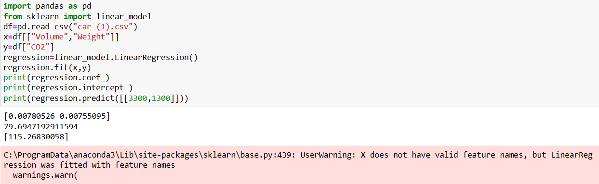

# Implementation of Multivariate Linear Regression
## Aim
To write a python program to implement multivariate linear regression and predict the output.
## Equipment’s required:
1.	Hardware – PCs
2.	Anaconda – Python 3.7 Installation / Moodle-Code Runner
## Algorithm:
### Step1
Import Pandas library.
### Step2
Import Linear_model from sklearn.
### Step3
Read the csv file using pandas library.
### Step4
Enter the parameters of the linear function.
### Step5
Print the parameters of the linear function.

## Program:
Developed by:Yokesh H
Register no:212224230312
```
import pandas as pd
from sklearn import linear_model
df=pd.read_csv("car (1).csv")
x=df[["Volume","Weight"]]
y=df["CO2"]
regression=linear_model.LinearRegression()
regression.fit(x,y)
print(regression.coef_)
print(regression.intercept_)
print(regression.predict([[3300,1300]]))
```
## Output:

### Insert your output

<br>

## Result
Thus the multivariate linear regression is implemented and predicted the output using python program.